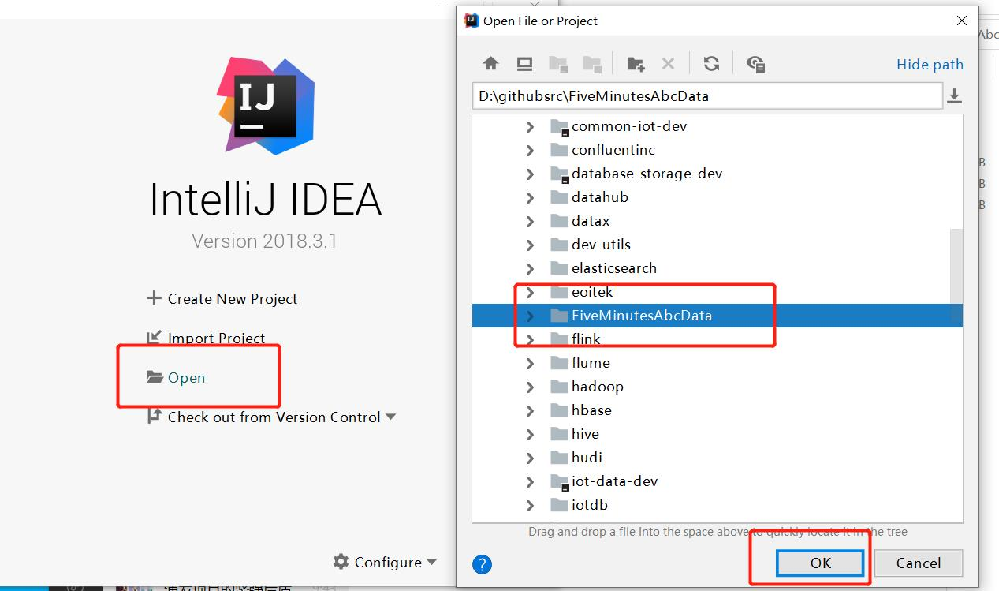
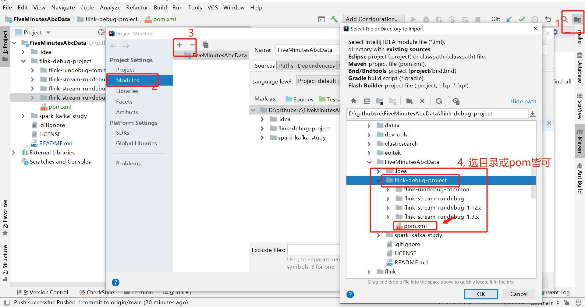
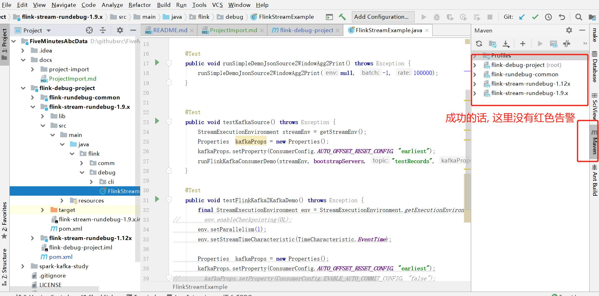

# FiveMinutesAbcData - ProjectImport 
5分钟入门数据技术 - IDEA导入 debug-project项目

# 环境准备: JDK, IDEA

请确保本地开发环境已准备好: 
* JDK(1.7+) 
* IDEA 

# 操作步骤

### 1.1 IDEA 打开 FiveMinutesAbcData 项目

安装好IDEA后, 点击 Open, 找到本项目并打开;

### 1.2 导入需要Debug的 学习项目

有 flink-debug-project, spark-debug-project 等Maven形式的学习项目可导入;
以导入Flink学习项目为例, 导入 flink-debug-project 学习项目

从File -> Project Structure -> Modules中, 点击 + 好导入新的 子模板

### 1.3 下载Maven依赖包和 完成导入

- 如果是Maven新用户, 初次导入Maven项目需要下载大量依赖包到本地mvn仓库, IDEA会自动下载;  
- 时间持续 几分钟到几个小时(慢的话); 后续想学习如何加速 Maven下载的话,参见其他文档;
- 自动下载 依赖包 (Download Dependencies..) 不能中途停止, 网络原因部分包可能会失败变红; 可参考文档解决: 

Maven项目导入成功后, 效果如如下: 

