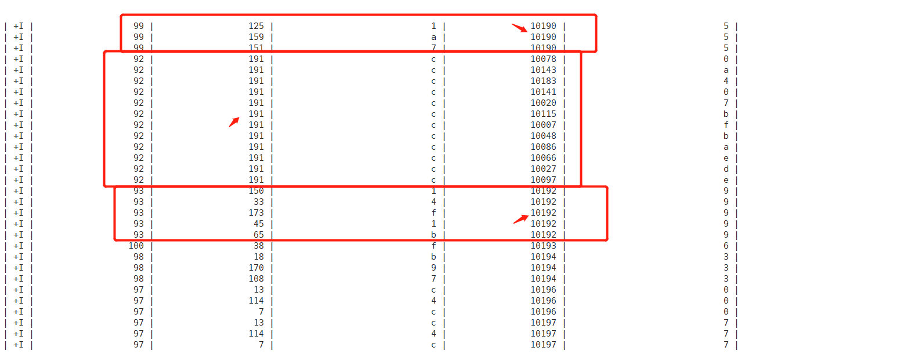
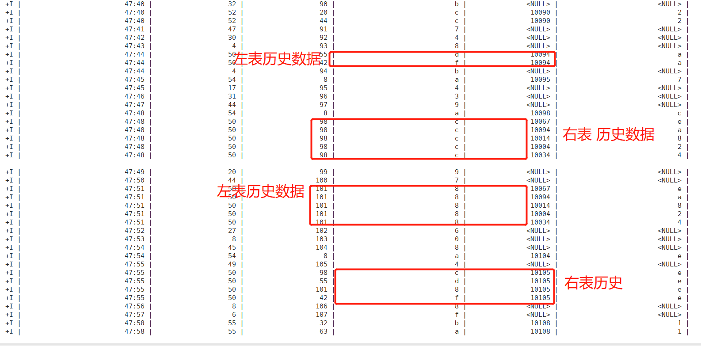
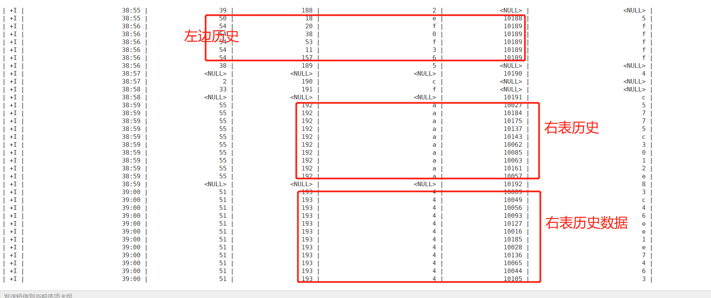
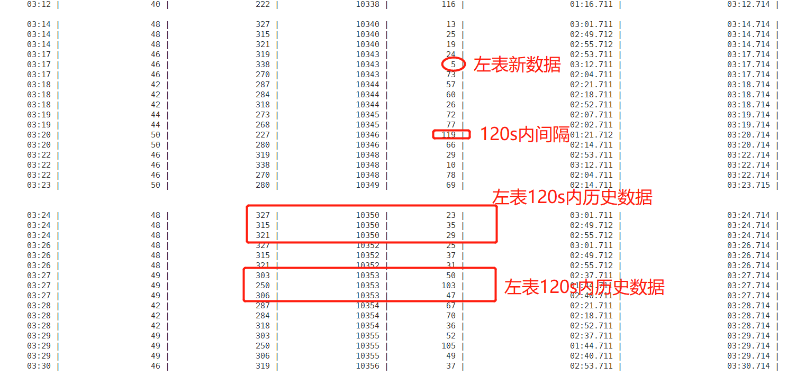

# Flink 基于Table-Store的实时数仓搭建Demo 

[toc]

## Demo 需求


准备 Catalog和Db
```sql

CREATE CATALOG test_mem_catalog WITH (
 'type'='generic_in_memory'
);
USE CATALOG test_mem_catalog;
show tables;

SET 'execution.checkpointing.interval' = '10 s';
SET 'sql-client.execution.result-mode' = 'tableau';
SET 'execution.runtime-mode' = 'streaming';

```

## 模拟数据: 点击表 + 曝光表 
曝光日志 + 点击日志 => 用户的曝光点击日志

```sql

USE CATALOG test_mem_catalog;

-- 曝光日志数据
DROP TABLE IF EXISTS show_log_table;
CREATE TABLE show_log_table (
    msg_id BIGINT,
    log_id BIGINT,
    show_params STRING,
    row_time AS cast(CURRENT_TIMESTAMP as timestamp(3)),
    WATERMARK FOR row_time AS row_time
) WITH (
'connector' = 'datagen',
'rows-per-second' = '1',
'fields.msg_id.kind' = 'sequence',
'fields.msg_id.start' = '1',
'fields.msg_id.end' = '10000',
'fields.show_params.length' = '1',
'fields.log_id.min' = '1',
'fields.log_id.max' = '50'
);

-- 点击日志数据
DROP TABLE IF EXISTS click_log_table;
CREATE TABLE click_log_table (
    msg_id BIGINT, 
    log_id BIGINT, 
    click_params STRING, 
    row_time AS cast(CURRENT_TIMESTAMP as timestamp(3)), 
    WATERMARK FOR row_time AS row_time 
) WITH (
'connector' = 'datagen',
'rows-per-second' = '1',
'fields.click_params.length' = '1',
'fields.msg_id.kind' = 'sequence',
'fields.msg_id.start' = '10001',
'fields.msg_id.end' = '20000',
'fields.log_id.min' = '40',
'fields.log_id.max' = '60'
);
SELECT * FROM click_log_table;

```


## Regular Join 常规表关联

```sql

--  INNER JOIN，条件为 log_id: 用户的曝光 + 点击日志 
SELECT
    DATE_FORMAT(PROCTIME(), 'mm:ss') AS q_time, 
    show_log_table.log_id AS log_key,
    show_log_table.msg_id AS show_msg_id, 
    show_log_table.show_params,
    click_log_table.msg_id AS click_msg_id,
    click_log_table.click_params 
FROM show_log_table
    INNER JOIN click_log_table ON show_log_table.log_id = click_log_table.log_id;


-- OutJoin: Left Join, 左边表全输出?  右边表匹配(ON条件,为 log_id相等),则输出;  用户的曝光 + 点击日志 
-- Left Join: 左表新数据(全) + 左表匹配历史数据 + 右表匹配历史数据; 
SELECT
    DATE_FORMAT(PROCTIME(), 'mm:ss') AS q_time,
    show_log_table.log_id AS log_key,
    show_log_table.msg_id AS show_msg_id,
    show_log_table.show_params,
    click_log_table.msg_id AS click_msg_id,
    click_log_table.click_params
FROM show_log_table
    LEFT JOIN click_log_table ON show_log_table.log_id = click_log_table.log_id;

-- OutJoin: Right Join,  右边表全输出, 左边表匹配(ON条件,为 log_id相等),则输出; 
SELECT
    DATE_FORMAT(PROCTIME(), 'mm:ss') AS q_time,
    show_log_table.log_id AS log_key,
    show_log_table.msg_id AS show_msg_id,
    show_log_table.show_params,
    click_log_table.msg_id AS click_msg_id,
    click_log_table.click_params
FROM show_log_table
    RIGHT JOIN click_log_table ON show_log_table.log_id = click_log_table.log_id;

--- OutJoin: Full Outer Join , 左表新数据 + 右表新数据 + 左表匹配的历史数据 + 右表匹配的历史数据; 
SELECT
  DATE_FORMAT(PROCTIME(), 'mm:ss') AS q_time,
  show_log_table.log_id AS log_key,
  show_log_table.msg_id AS show_msg_id,
  show_log_table.show_params,
  click_log_table.msg_id AS click_msg_id,
  click_log_table.click_params
FROM show_log_table
    FULL OUTER JOIN click_log_table ON show_log_table.log_id = click_log_table.log_id;


```


Rugular Join 特点: 
* 历史数据无止境的关联(缓存); Regular没有缓存清理策略; 
* Inner Join, 只输出 完全匹配(On条件)的行;  新数据中左表右表完全匹配的 + 左表匹配历史数据 + 右表匹配历史数据;



LeftJoin(Regular): 左表新数据(全) + 左表匹配历史数据 + 右表匹配历史数据;


Full-Out-Join: 左表新数据 + 右表新数据 + 左表匹配的历史数据 + 右表匹配的历史数据; 


## Window Interval Join 时间间隔管理

Interval Join 可以让一条流去 Join 另一条流中前后一段时间内的数据
Interval Join 可用于消灭回撤流的。?
Time-Windowed Join 利用窗口给两个输入表设定一个 Join 的时间界限，超出时间范围的数据则对 JOIN 不可见并可以被清理掉。


```sql

--  IntervalWindowJoin: INNER JOIN，
SELECT
  DATE_FORMAT(PROCTIME(), 'mm:ss') AS q_time,
  show_log_table.log_id AS log_key,
  show_log_table.msg_id AS show_msg_id,
  click_log_table.msg_id AS click_msg_id,
  timestampDiff(SECOND, show_log_table.row_time, click_log_table.row_time) AS interval_120s,
  DATE_FORMAT(show_log_table.row_time, 'mm:ss.SSS') AS show_time,
  DATE_FORMAT(click_log_table.row_time, 'mm:ss.SSS') AS click_time
FROM show_log_table INNER JOIN click_log_table ON show_log_table.log_id = click_log_table.log_id
  AND show_log_table.row_time BETWEEN click_log_table.row_time - INTERVAL '2' MINUTE AND click_log_table.row_time;

-- 测试时, 可分别设置 时间间隔 30s -> 2min -> 1hour

```


IntervalJoin_InnerJoin: 新数据( 右表 + 左表  ) + 左表2分钟内历史数据 右表(看Interval条件)


## Temporal Table Join 动态拉链表关联Join


## Lookup Join 


## 关于Stream SQL 种的Join比较 

实时流, Streaming SQL（面向无界数据集的 SQL）无法缓存所有数据, 也无法对数据集排序;
设置一个缓存剔除策略将不必要的历史数据及时清理是必然策略; 关键在于缓存剔除策略如何实现，这也是 Flink SQL 提供的三种 Join 的主要区别。
* Regular Join 是最为基础的没有缓存剔除策略的 Join。Regular Join 中两个表的输入和更新都会对全局可见，影响之后所有的 Join 结果。
  - 因为历史数据不会被清理，所以 Regular Join 允许对输入表进行任意种类的更新操作（insert、update、delete）。然而因为资源问题 Regular Join 通常是不可持续的，一般只用做有界数据流的 Join。
* 

而 Nested-loop Join 和 Hash Join 经过一定的改良则可以满足实时 SQL 的要求。 Nested Join 在实时 Streaming SQL 的基础实现


